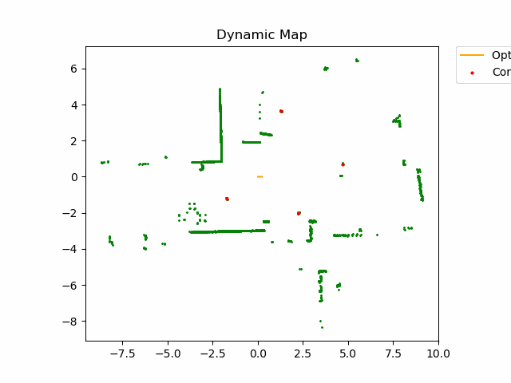

# mobile_robotics_slam
ROS2 Package to perform GRAPH SLAM extracting Corners and Reflectors Features from the environment using a 2D Lidar

## Usage

1. First of all go to your workspace src folder and clone the repository then build from the root of your workspace:
      ```bash
          cd ~/your_workspace/src
          git clone https://github.com/NicolaFrancesconi/mobile_robotics_slam.git
          cd ~/your_workspace/
          catkin_make

      ```
2. Before running the node be sure to subscribe correctly to your scan, odometry and real pose:
   To do this go in the param file: [simulation_params.py](/mobile_robotics_slam/Params/simulation_params.py).
      ```ruby
            ODOM_TOPIC = "/odometry/filtered"  # Topic where the scan is published
            SCAN_TOPIC = "/scan"  # Topic where the odometry is published
            REAL_POSE_TOPIC = "/real_pose"  # Topic where the real pose is published  
      ```
    WARNING: IF THE REAL POSE OF ROBOT IS NOT AVAILABLE, substitute the real pose topic with the odometry one:
      ```ruby
            ODOM_TOPIC = "/odometry/filtered"  # Topic where the scan is published
            SCAN_TOPIC = "/scan"  # Topic where the odometry is published
            REAL_POSE_TOPIC = "/odometry/filtered"  # Topic where the real pose is published    
      ```

3. Open a new terminal. To run the node you have first of all to source ros and install the setup.bash in the root of your workspace
      ```bash
          source /opt/ros/<ROS_DISTRO>/setup.bash
          cd ~/your_workspace/
          . devel/setup.bash
          rosrun mobile_robotics_slam graph_slam_node_ros1.py
      ```

4. While the node is running you can press `Ctrl + C` in the terminal to save the trajectory of the poses inserted in the graph as `.txt` file in
   the  `mobile_robotics_slam/trajectory_data` directory. 
   The frame of the map are automatically stored in the [frames](/frames) directory. Once frames are present, you can transform them into
   a gif by running the python script: [MapGIFGenerator.py](mobile_robotics_slam/MapGenerator/MapGIFGenerator.py) and a gif like the following      will be created and it will be located in the [gif](/gif) directory.

   
   
